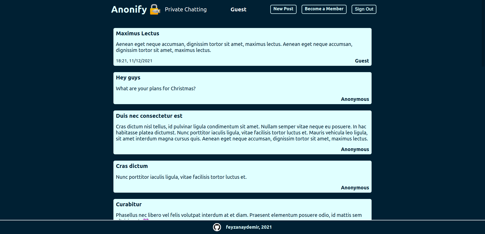

# Anonify

NodeJS messaging application where users can share anonymous posts.

- ### [See Live](https://anonify.herokuapp.com/)

## Features

- MVC pattern ExpressJS and NodeJS backend with REST API
- MongoDB integration with Mongoose
- EJS engine for Views
- Form sanitization and validation with Express Validator
- User authentication with PassportJS
- Visitors without an account
  - Can view the existing content
  - Cannot see the timestamps and the authors
  - Cannot create posts
- Regular users without any membership status
  - Can create and view posts
  - Cannot see the timestamps and the authors
- Users who have a valid membership code
  - Can see the timestamps and the authors
- Users who have a valid moderator code
  - Can see the timestamps and the authors
  - Can delete messages
