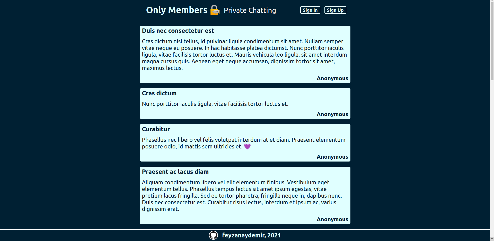

# Only Members

Only Members is an online messaging application where users can share anonymous posts. This app was made with Express.js, Node.js and MongoDB using MVC pattern. Passport.js was used as authentication middleware.

- Visitors without an account cannot create posts. They can view the existing content but cannot see the timestamps and the authors.
- Regular users without any membership status can create and view posts but cannot see the timestamps and the authors of other messages.
- Users who have a valid membership code can see the timestamps and the authors of other messages.
- Users who have a valid moderator code can see the timestamps and the authors. Mods have authorization to delete each message.
